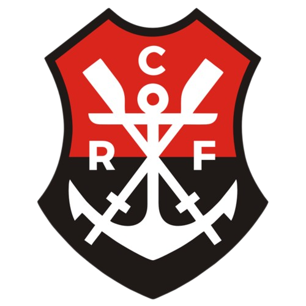

# Flamengo Titles

Explore the main glories of Flamengo throughout another century of history.

Informative website, full of historical facts, pictures and information of the main trophies Flamengo has won so far.

Access it on: [https://flamengo-titles.netlify.app/](https://flamengo-titles.netlify.app/)

If you are still not familiarized with this amazing football club, don't wait any further and start exploring all these honours.

Website created to practice building a simple, yet informative design, gathering all Flamengo titles information in a single space. 

Important technical skills on practice: 
- Retrieving data from a database (Firestore)
- Building a design from scratch
- Responsive design, to different modern popular devices
- Multi-language website, adaptative to user choice
- Optimized website routes, with error page for specific routes or database error

### Built With

- React.js
- Typescript
- Created project with Vite
- Firebase
- Styled Components

## Features

There is a lack on the internet of a centralized space to explore Flamengo's glories. This project provide a place to search for historical facts, pictures and statistics of Flamengo main titles. For example, search for the names of the winning squad from Libertadores 1981, or check if the legendary squad from 2019 scored more goals than 2009s winners.

## Contact

To contact me and for more projects:

- Portfolio: [https://breno-perricone.netlify.app/](https://breno-perricone.netlify.app/)
- Linkedin: [www.linkedin.com/in/breno-perricone-fischer-191964129](www.linkedin.com/in/breno-perricone-fischer-191964129)
